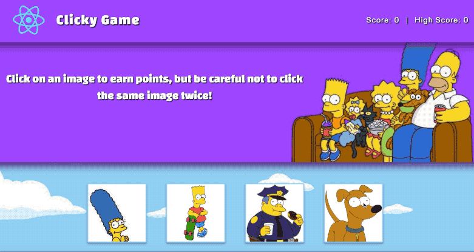

# React-Clicky-Game 🍩🍺

A simple memory game built with React. 

<a href="https://amandadovel.github.io/React-Clicky-Game/">Simpsons Clicky Game</a>

## Functionality 💪
#### Here's how the app works: 
1. Click on any image to get started and points will increase. 

2. Click on the same image twice and points will decrease. 

3. Score is located on the top right corner of the page, 

## Getting Started 🏁

These instructions will get you a copy of the project up and running on your local machine for grading and testing purposes. 

1. Clone repository. Click on the clone button next to the repository (clone with SSH).
2. Open Terminal and git clone (paste) into directory of your choice. 
3. Open folder in VS Code. 
4. After the files necessary for the react app, the file structure follows an MVC pattern with the main diretories being `client`, `controllers`, `models`, `routes`, `scripts` and the `server.js` file which connects the app to the database and the server. 
5. The client directory holds all of the logic connecting the backend to the front.
6. Each component is defined within the `components` directory. 
7. Each of the necessary pages displayed in the browser are defined in the `pages` directory.
8. the `models` folder handles the data of the application. 
9. The logic for the google books API is held in the `controllers` directory.
10. The `routes` folder holds the logic for the routes which receives the user input, validates it and passes it through the modls.

## Pre-Requisites ✔️

1. Node - use this site to install node into your computer: https://nodejs.org/en/download/
    *to check if node is installed type node -v into your terminal. If installed it will print the version number on the screen.
2. NPM (https://www.npmjs.com/) - Node Package Manager. Use this site to assist in downloading packages or modules. 
3. Install dependencies using `npm install`.

## Built With 🔧

* [React](https://reactjs.org/) - Component based Javascript library used for creating    interactive user interfaces specifically for single page layouts. 
* [Node](https://nodejs.org/en/download/) - As an asynchronous event driven JavaScript    runtime, Node is designed to build scalable network applications. 
* [Javascript](https://www.javascript.com/) - JavaScript is the programming language of   HTML and the Web
* [JSON](https://www.json.org/) - Javascript object notation, syntax for storing and      exchanging information. 
* [Express](https://www.npmjs.com/package/express) - Node.js web app framework            designed to make developing websites, web apps, & API's much easier.
* [MVC](https://www.geeksforgeeks.org/mvc-design-pattern/) - The Model-View-Controller    is an architectural pattern that separates an application into three main logical       components: the model, the view, and the controller.
* [Heroku](https://www.heroku.com/) - A cloud based platform that lets companies           build, deliver, monitor and scale applications.
 

## Author ⌨️

*** Amanda Dovel *** - [amandadovel](https://github.com/amandadovel)

